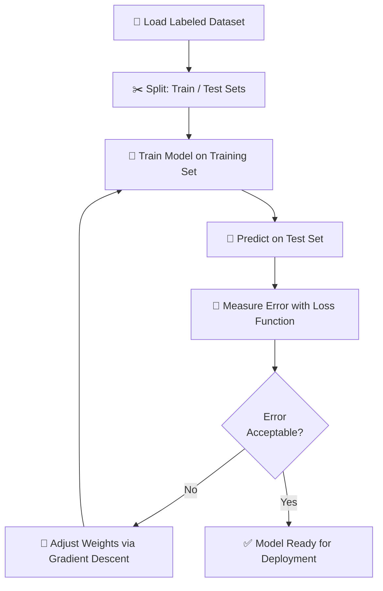
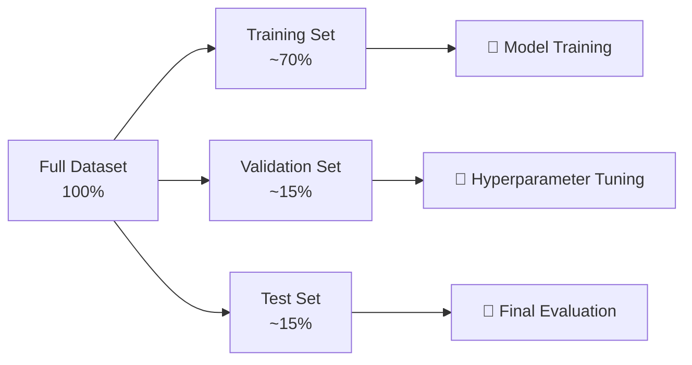

# 🧠 Chapter 1: Supervised Learning — Rule Followers

> "Machines learn best when you show them the answers first."

📍 **Navigation:** [🏠 Home](../readme.md) | **Chapter 1** | [Chapter 2: Unsupervised Learning →](../Chapter%202%20-%20Unsupervised%20Learning/chap2.md)

---

> [!TIP]
> **⚡ Key Takeaways**
> - Supervised learning trains on **labeled** input-output pairs
> - Two types: **Classification** (discrete output) and **Regression** (continuous output)
> - Core algorithms: Linear Regression, Logistic Regression
> - Performance is measured with Accuracy, Precision, Recall, MSE, R²

---

# 📌 1. What is Supervised Learning?

Supervised Learning is a type of Machine Learning where the model is trained on **labeled data** — every input $X$ has a known correct output $Y$.

- **Input (X)** → Features (the information you provide)
- **Output (Y)** → Labels (the correct answers)

The goal is to learn a mapping function:

$$
f(X) = Y
$$

So that the model can **predict outputs** for new, unseen inputs.


---

# 🔁 2. How Learning Happens — The Training Loop




> [!NOTE]
> **🔍 Deep Dive: The End-to-End ML Pipeline**
> 

---

# 🎯 3. Core Idea

You act like a **teacher**, and the model is a **student**.

| Step | Description |
|------|-------------|
| 1 | Provide input data (features) |
| 2 | Provide correct output (label) |
| 3 | Model makes a prediction |
| 4 | Compare prediction with actual answer |
| 5 | Adjust model weights to reduce error |
| 6 | Repeat until performance is satisfactory |

---

# 🔀 4. Types of Supervised Learning

## 📊 4.1 Classification

### 📌 Definition

Predicts a **category** or **class** from a discrete set of options.

### 📍 Examples

- Spam vs Not Spam
- Disease vs Healthy
- Cat vs Dog vs Bird

### 🧠 Output Type

Discrete / Categorical values:

$$
Y \in \{0, 1\} \quad \text{(binary)} \qquad \text{or} \qquad Y \in \{C_1, C_2, \ldots, C_k\} \quad \text{(multiclass)}
$$


> [!NOTE]
> **🔍 Deep Dive: Classification Decision Boundary**
> 

---

## 📈 4.2 Regression

### 📌 Definition

Predicts a **continuous numerical value**.

### 📍 Examples

- House price prediction
- Temperature forecasting
- Salary estimation

### 🧠 Output Type

Continuous real-valued output:

$$
Y \in \mathbb{R}
$$


---

# ⚖️ 5. Classification vs Regression

| Feature | Classification | Regression |
|---------|---------------|------------|
| Output Type | Discrete (categories) | Continuous (numbers) |
| Example | Spam detection | House price |
| Goal | Assign a category | Predict a numeric value |
| Algorithms | Logistic Regression, SVM, Decision Tree | Linear Regression, Ridge, Lasso |
| Metrics | Accuracy, Precision, Recall, F1 | MSE, RMSE, MAE, R² |

---

# 🧮 6. Key Algorithms

## 📉 6.1 Linear Regression

Used for **regression** problems. Models a straight-line relationship between input and output.

### 📌 Formula

In multiple dimensions:

$$
\hat{y} = w_1 x_1 + w_2 x_2 + \cdots + w_n x_n + b
$$

In simple 2D form:

$$
y = mx + b
$$

Where:
- $m$ = slope (weight / coefficient)
- $b$ = bias (intercept)

### 🎯 Goal

Minimize the **Mean Squared Error (MSE)**:

$$
\text{MSE} = \frac{1}{n} \sum_{i=1}^{n} (y_i - \hat{y}_i)^2
$$

> [!NOTE]
> **🔍 Deep Dive: The Gradient Descent Journey**
> 

---

## 📊 6.2 Logistic Regression

Used for **binary classification**. Maps any input to a probability between 0 and 1.

### 📌 Formula — Sigmoid Function

$$
\sigma(z) = \frac{1}{1 + e^{-z}}
$$

### 🎯 Output

- Value in $(0, 1)$ → interpreted as a probability
- If $\sigma(z) \geq 0.5$, predict **class 1**; else predict **class 0**

---

# 📏 7. Evaluation Metrics

## 📊 For Classification

| Metric | Formula | Meaning |
|--------|---------|---------|
| Accuracy | $\frac{TP + TN}{TP + TN + FP + FN}$ | Overall correctness |
| Precision | $\frac{TP}{TP + FP}$ | How exact are positive predictions |
| Recall | $\frac{TP}{TP + FN}$ | How complete are positive predictions |
| F1-Score | $2 \times \frac{P \times R}{P + R}$ | Balance of Precision & Recall |

> [!NOTE]
> Use **Precision** when false positives are costly (e.g., spam filter).
> Use **Recall** when false negatives are costly (e.g., disease detection).

---

## 📈 For Regression

| Metric | Formula | Meaning |
|--------|---------|---------|
| MSE | $\frac{1}{n}\sum (y - \hat{y})^2$ | Mean squared error |
| RMSE | $\sqrt{\text{MSE}}$ | Error in original units |
| MAE | $\frac{1}{n}\sum \lvert y - \hat{y} \rvert$ | Mean absolute error |
| R² | $1 - \frac{SS_{res}}{SS_{tot}}$ | Proportion of variance explained |

---

# ⚙️ 8. Important Concepts

## 🔹 Features & Labels

| Term | Meaning | Example |
|------|---------|---------|
| Features (X) | Input variables | Age, salary, area |
| Labels (Y) | Output / target value | Price, category |

---

## 🔹 Overfitting vs Underfitting

| Concept | Meaning | Sign | Fix |
|---------|---------|------|-----|
| Overfitting | Model memorizes training data | High train accuracy, low test accuracy | Regularization, Dropout, more data |
| Underfitting | Model too simple to capture patterns | Low train and test accuracy | More complex model, more features |
| Just Right | Generalizes well to new data | Balanced accuracy on train & test | ✅ |

---

## 🔹 Train / Test / Validation Split



---

# 🧪 9. Real-World Applications

| Domain | Use Case | Algorithm |
|--------|----------|-----------|
| Healthcare | Disease prediction | Logistic Regression |
| Finance | Fraud detection | Decision Trees / SVM |
| Email | Spam filtering | Naive Bayes |
| Real Estate | Price prediction | Linear Regression |
| HR | Employee attrition | Random Forest |

---

# 🔑 10. Key Terms Glossary

| Term | Definition |
|------|-----------|
| **Supervised Learning** | Learning from labeled input-output pairs |
| **Feature** | An individual measurable property of the data |
| **Label** | The correct output for a training example |
| **Training Set** | Data used to fit the model |
| **Test Set** | Data used to evaluate model performance |
| **Overfitting** | Model performs well on training but poorly on unseen data |
| **Underfitting** | Model is too simple to capture patterns |
| **Loss Function** | Measures how far predictions are from actual values |
| **Gradient Descent** | Optimization algorithm that minimizes the loss |
| **Hyperparameter** | Settings configured before training (e.g., learning rate) |

---

# 💡 11. Practice Ideas

| Project | Algorithm | Dataset |
|---------|-----------|---------|
| 🏠 House Price Predictor | Linear Regression | Kaggle Housing Data |
| 📧 Spam Email Classifier | Logistic Regression | UCI Spambase |
| 🏥 Diabetes Predictor | Logistic Regression | PIMA Indians Diabetes |
| 🌸 Flower Species Classifier | Decision Tree / KNN | Iris Dataset |
| 📊 Student Pass/Fail Predictor | Logistic Regression | Custom Dataset |

**Starter code:**

```python
from sklearn.linear_model import LinearRegression
from sklearn.model_selection import train_test_split
from sklearn.metrics import mean_squared_error

X_train, X_test, y_train, y_test = train_test_split(X, y, test_size=0.2)
model = LinearRegression()
model.fit(X_train, y_train)          # Train
y_pred = model.predict(X_test)       # Predict
print(mean_squared_error(y_test, y_pred))
```

---

# 📚 12. Further Reading

- 📖 [Scikit-Learn: Supervised Learning](https://scikit-learn.org/stable/supervised_learning.html)
- 🎥 [StatQuest: Linear Regression](https://www.youtube.com/watch?v=nk2CQITm_eo)
- 🎥 [StatQuest: Logistic Regression](https://www.youtube.com/watch?v=yIYKR4sgzI8)
- 📖 [Google ML Crash Course](https://developers.google.com/machine-learning/crash-course)
- 📖 [Andrew Ng: ML Specialization (Coursera)](https://www.coursera.org/specializations/machine-learning-introduction)

---

# 🚀 Final Thought

Supervised Learning is the **foundation of Machine Learning**.
Master this, and everything else becomes easier.

---

📍 **Navigation:** [🏠 Home](../readme.md) | **Chapter 1** | [Chapter 2: Unsupervised Learning →](../Chapter%202%20-%20Unsupervised%20Learning/chap2.md)
