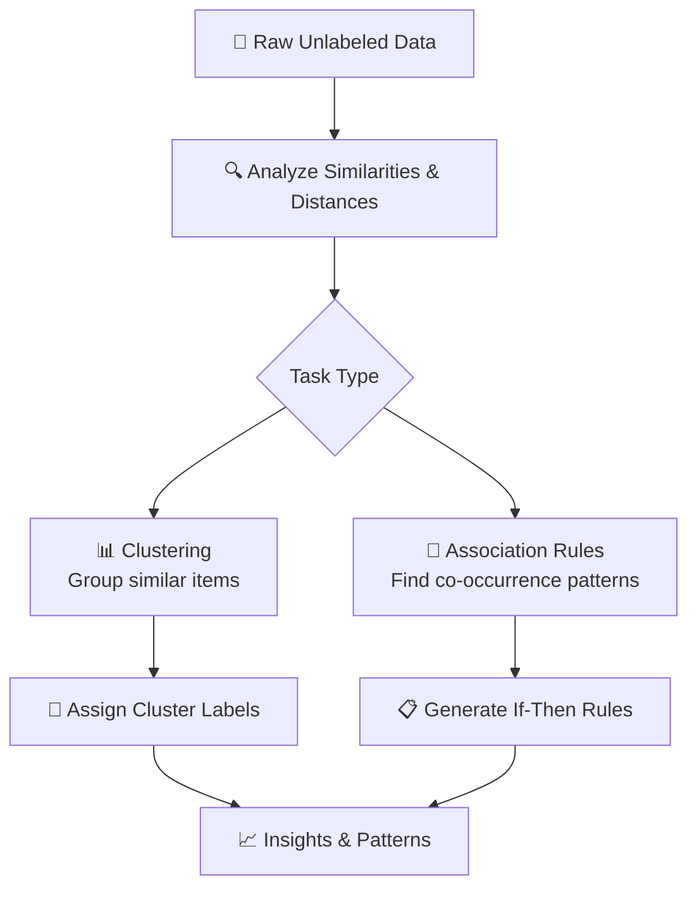
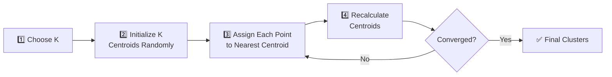

# 🧩 Chapter 2: Unsupervised Learning — Pattern Detectives

> "When no answers are given, patterns become the answers."

📍 **Navigation:** [🏠 Home](../readme.md) | [← Chapter 1](../Chapter%201%20-%20Supervised%20Learning/chap1.md) | **Chapter 2** | [Chapter 3: Neural Networks →](../Chapter%203%20-%20Neural%20Networks/chap3.md)

---

> [!TIP]
> **⚡ Key Takeaways**
> - Unsupervised learning works on **unlabeled** data — no predefined answers
> - Two main types: **Clustering** (group similar items) and **Association Rules** (find relationships)
> - K-Means is the most popular clustering algorithm
> - Apriori and ECLAT are the go-to association rule algorithms

---

# 📌 1. What is Unsupervised Learning?

Unsupervised Learning is a type of Machine Learning where the model is trained on **unlabeled data** — there are no predefined correct outputs.

- No labeled outputs provided
- Model discovers hidden structures and relationships

$$
\text{Given } X \Rightarrow \text{Find patterns / structure}
$$


---

# 🔁 2. How It Works — The Discovery Flow



---

# 🎯 3. Core Idea

The model acts like a **detective** — finding hidden structure with no guidance.

| Step | Description |
|------|-------------|
| 1 | Input raw, unlabeled data |
| 2 | Analyze similarities or distances |
| 3 | Detect patterns or associations |
| 4 | Group or associate data points |
| 5 | Report discovered structure |

---

# 🔀 4. Types of Unsupervised Learning

| Type | Goal | Algorithm | Example |
|------|------|-----------|---------|
| Clustering | Group similar data points | K-Means, DBSCAN | Customer segmentation |
| Association Rules | Find co-occurring patterns | Apriori, ECLAT | Market basket analysis |
| Dimensionality Reduction | Compress data | PCA, t-SNE | Feature reduction |

---

# 🧮 5. K-Means Clustering

## 📌 Objective

Divide data into **K clusters**, minimizing the within-cluster distances.

## 🔁 Algorithm Steps



---

## 📐 Distance Formula — Euclidean

$$
d = \sqrt{(x_1 - x_2)^2 + (y_1 - y_2)^2}
$$

---

## 📊 Objective Function — WCSS (Within Cluster Sum of Squares)

$$
\text{WCSS} = \sum_{k=1}^{K} \sum_{x_i \in C_k} (x_i - \mu_k)^2
$$

Where:
- $\mu_k$ = centroid of cluster $C_k$
- Goal: **minimize WCSS**

---

# 📉 6. Elbow Method

Used to find the **optimal number of clusters** $K$.

### 📌 Idea

- X-axis → Number of clusters ($K$)
- Y-axis → WCSS

**Choose $K$ where the curve bends sharply** (the "elbow" point).

> [!NOTE]
> Beyond the elbow, adding more clusters gives diminishing returns. Use domain knowledge to confirm the final choice.

.png)

> [!NOTE]
> **🔍 Deep Dive: WCSS & The Elbow**
> 

---

# 🔄 7. K-Means vs K-Medoids

| Feature | K-Means | K-Medoids |
|---------|---------|-----------|
| Center Type | Mean (may not be an actual data point) | Actual data point (medoid) |
| Sensitivity | Sensitive to outliers | More robust to outliers |
| Speed | Faster | Slower |
| Use Case | Clean, numeric data | Data with noise/outliers |


---

# 🔗 8. Association Rule Learning

## 📌 Goal

Find rules of the form: $X \Rightarrow Y$

**Example:** Customers who buy `{Bread, Milk}` also buy `{Eggs}`

---

## 📏 Key Metrics

### 📊 Support — How frequent is the itemset?

$$
\text{Support}(X) = \frac{\text{Transactions containing } X}{\text{Total Transactions}}
$$

---

### 📊 Confidence — How reliable is the rule?

$$
\text{Confidence}(X \Rightarrow Y) = \frac{\text{Support}(X \cup Y)}{\text{Support}(X)}
$$

---

### 📊 Lift — Is the association meaningful?

$$
\text{Lift}(X \Rightarrow Y) = \frac{\text{Confidence}(X \Rightarrow Y)}{\text{Support}(Y)}
$$

| Lift Value | Meaning |
|-----------|---------|
| Lift > 1 | Positive association (items bought together more than by chance) |
| Lift = 1 | No association |
| Lift < 1 | Negative association |


---

# 🧠 9. Apriori Algorithm

## 📌 Principle

> "If an itemset is frequent, all its subsets must also be frequent."

This **anti-monotone property** allows pruning large portions of the search space.

> [!NOTE]
> **🔍 Deep Dive: The Apriori Principle**
> 

## 🔁 Steps

1. Set minimum support threshold
2. Find all frequent 1-itemsets
3. Generate candidate $k$-itemsets from frequent $(k{-}1)$-itemsets
4. Remove itemsets below minimum support
5. Repeat until no new frequent itemsets found
6. Generate association rules from frequent itemsets

---

# ⚡ 10. ECLAT Algorithm

## 📌 Key Idea

Uses a **vertical data format** — stores a list of Transaction IDs (TIDs) per itemset, rather than scanning the full dataset.

- Uses **set intersection** to compute support efficiently
- More memory-efficient for dense datasets

## 📊 Apriori vs ECLAT

| Feature | Apriori | ECLAT |
|---------|---------|-------|
| Data Format | Horizontal (transactions list) | Vertical (TID list per item) |
| Speed | Slower (multiple DB scans) | Faster (set intersections) |
| Approach | Breadth-first | Depth-first |
| Memory Usage | Lower | Higher |
| Best For | Sparse data | Dense data |


---

# ⚙️ 11. Important Concepts

## 🔹 Centroid

Center of a cluster — recalculated each iteration:

$$
\mu_k = \frac{1}{\lvert C_k \rvert} \sum_{x_i \in C_k} x_i
$$

---

## 🔹 Similarity Measures

| Measure | Formula | Best For |
|---------|---------|---------|
| Euclidean | $\sqrt{\sum (x_i - y_i)^2}$ | Continuous numeric data |
| Manhattan | $\sum \lvert x_i - y_i \rvert$ | Grid-like / city distances |
| Cosine | $\frac{x \cdot y}{\lVert x \rVert \lVert y \rVert}$ | Text / high-dimensional data |

---

# 🧪 12. Real-World Applications

| Domain | Use Case | Algorithm |
|--------|----------|-----------|
| Marketing | Customer segmentation | K-Means |
| Retail | Product recommendation rules | Apriori |
| Finance | Fraud pattern detection | DBSCAN |
| Social Media | User behavior grouping | K-Means |
| Biology | Gene expression clustering | Hierarchical |

---

# 🔑 13. Key Terms Glossary

| Term | Definition |
|------|-----------| 
| **Clustering** | Grouping similar data points without labels |
| **Centroid** | The mean position of all points in a cluster |
| **WCSS** | Within Cluster Sum of Squares — measures cluster tightness |
| **Elbow Method** | Technique to find optimal $K$ for K-Means |
| **Association Rule** | An if-then pattern: $X \Rightarrow Y$ |
| **Support** | Frequency of an itemset in the dataset |
| **Confidence** | Reliability of an association rule |
| **Lift** | Strength of an association relative to random chance |
| **Apriori Principle** | Frequent itemsets' subsets are also frequent |
| **TID** | Transaction ID — used in ECLAT's vertical format |

---

# 💡 14. Practice Ideas

| Project | Algorithm | Dataset |
|---------|-----------|---------| 
| 👥 Customer Segmentation | K-Means | Mall Customers Dataset |
| 🛒 Market Basket Analysis | Apriori | Groceries Dataset |
| 🗞️ News Article Clustering | K-Means + TF-IDF | BBC News Dataset |
| 🧬 Gene Expression Groups | Hierarchical Clustering | UCI Gene Expression |

**Starter code:**

```python
from sklearn.cluster import KMeans
import matplotlib.pyplot as plt

# Find optimal K using Elbow Method
wcss = []
for k in range(1, 11):
    model = KMeans(n_clusters=k, random_state=42)
    model.fit(X)
    wcss.append(model.inertia_)

plt.plot(range(1, 11), wcss, marker='o')
plt.xlabel('Number of Clusters (K)')
plt.ylabel('WCSS')
plt.title('Elbow Method')
plt.show()
```

---

# 📚 15. Further Reading

- 📖 [Scikit-Learn: Clustering](https://scikit-learn.org/stable/modules/clustering.html)
- 🎥 [StatQuest: K-Means Clustering](https://www.youtube.com/watch?v=4b5d3muPQmA)
- 📖 [mlxtend: Association Rules](http://rasbt.github.io/mlxtend/user_guide/frequent_patterns/apriori/)
- 🎥 [StatQuest: PCA (Dimensionality Reduction)](https://www.youtube.com/watch?v=FgakZw6K1QQ)

---

# 🚀 Final Thought

Unsupervised Learning helps uncover **hidden insights** that humans might miss.

The patterns are already there in the data — you just need the right algorithm to reveal them.

---

📍 **Navigation:** [🏠 Home](../readme.md) | [← Chapter 1](../Chapter%201%20-%20Supervised%20Learning/chap1.md) | **Chapter 2** | [Chapter 3: Neural Networks →](../Chapter%203%20-%20Neural%20Networks/chap3.md)
