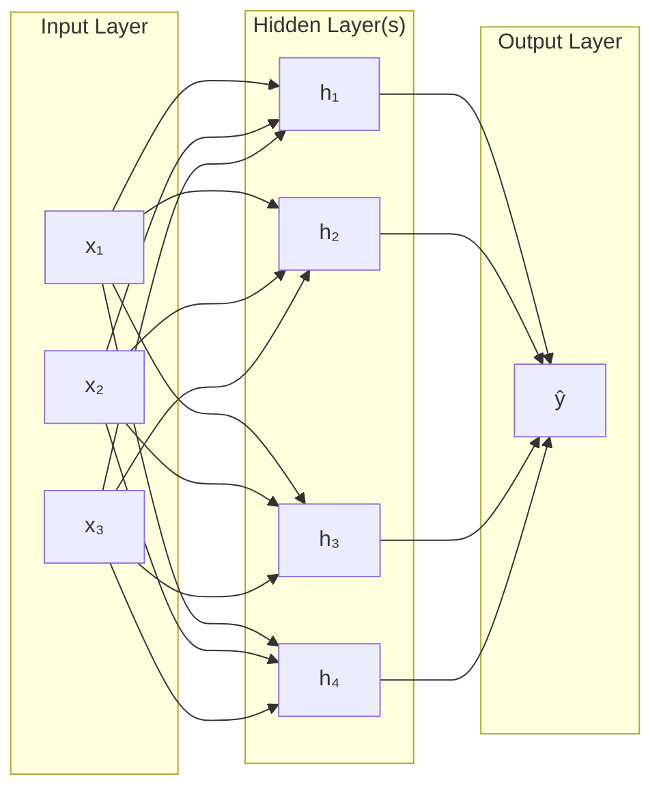
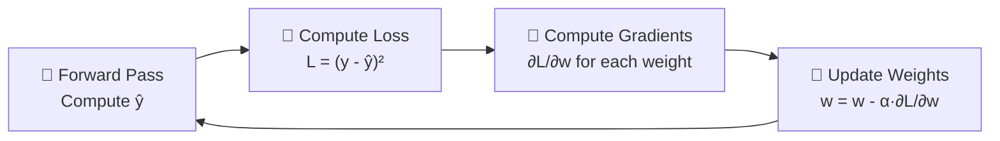

# 🤖 Chapter 3: Neural Networks — Brain Copycats

> "Neural Networks are machines inspired by how we think."

📍 **Navigation:** [🏠 Home](../readme.md) | [← Chapter 2](../Chapter%202%20-%20Unsupervised%20Learning/chap2.md) | **Chapter 3** | [Chapter 4: Advanced Learning →](../Chapter%204%20-%20Advanced%20Learning/chap4.md)

---

> [!TIP]
> **⚡ Key Takeaways**
> - A neural network is made of **layers of interconnected neurons**
> - Each neuron applies: weighted sum → add bias → activation function
> - **Forward propagation** computes predictions; **backpropagation** updates weights
> - **Deep Learning** = neural networks with many hidden layers

---

# 📌 1. What is a Neural Network?

A Neural Network is a computational model inspired by the **human brain**, made up of interconnected units called **neurons** (nodes).

$$
\text{Inputs} \rightarrow \text{Neurons} \rightarrow \text{Output}
$$

Each neuron processes information and passes it forward to the next layer.

---

# 🧠 2. Biological vs Artificial Neuron

| Feature | Biological Neuron | Artificial Neuron |
|---------|------------------|-------------------|
| Input | Dendrites | Input features ($x_1, x_2, \ldots$) |
| Processing | Cell body | Weighted sum + bias |
| Output | Axon | Activation output |
| Signal | Electrical impulse | Numerical value |
| Learning | Synaptic change | Weight update |


---

# ⚙️ 3. Artificial Neuron — The Math

## 📌 Components

- Inputs: $x_1, x_2, \ldots, x_n$
- Weights: $w_1, w_2, \ldots, w_n$
- Bias: $b$
- Activation Function: $f$

## 🧮 Formula

**Step 1 — Weighted Sum:**

$$
z = \sum_{i=1}^{n} w_i x_i + b
$$

**Step 2 — Activation:**

$$
y = f(z)
$$


---

# 🔥 4. Activation Functions

Activation functions determine **whether a neuron should fire** — they introduce non-linearity into the network.

## 📊 Comparison Table

| Function | Formula | Output Range | Best Used For |
|----------|---------|-------------|---------------|
| Sigmoid | $\frac{1}{1+e^{-x}}$ | $(0, 1)$ | Binary classification output |
| Tanh | $\frac{e^x - e^{-x}}{e^x + e^{-x}}$ | $(-1, 1)$ | Hidden layers (zero-centered) |
| ReLU | $\max(0, x)$ | $[0, \infty)$ | Hidden layers (most common) |
| Softmax | $\frac{e^{x_i}}{\sum e^{x_j}}$ | $(0, 1)$, sums to 1 | Multiclass output layer |


---

### 🔹 Sigmoid

$$
\sigma(x) = \frac{1}{1 + e^{-x}}
$$

- Output: $(0, 1)$ — use for binary classification output
- Problem: **Vanishing gradient** for large inputs

---

### 🔹 ReLU — Rectified Linear Unit

$$
f(x) = \max(0, x)
$$

- Fast, widely used in hidden layers
- Solves vanishing gradient; can suffer from "dying ReLU"

---

### 🔹 Tanh

$$
\tanh(x) = \frac{e^x - e^{-x}}{e^x + e^{-x}}
$$

- Output: $(-1, 1)$ — zero-centered, better than Sigmoid for hidden layers

---

# 🏗️ 5. Neural Network Architecture

## 📌 Layers

| Layer | Role | Example Size |
|-------|------|-------------|
| Input Layer | Receives raw data | 1 neuron per feature |
| Hidden Layer(s) | Extracts patterns | 32, 64, 128 neurons |
| Output Layer | Produces prediction | 1 (regression) or $k$ (classification) |

## 🔁 Data Flow Diagram



---

# 🧠 6. Deep Learning

When a network has **multiple hidden layers**, it is called a **Deep Neural Network (DNN)**.

| Depth | Name | Capability |
|-------|------|-----------|
| 1 hidden layer | Shallow Network | Simple patterns |
| 2–5 hidden layers | Deep Network | Complex patterns |
| 10+ hidden layers | Very Deep Network | Images, speech, NLP |

### 📌 Why Go Deep?

- Each layer learns increasingly **abstract representations**
- Layer 1 → edges; Layer 2 → shapes; Layer 3 → objects (in image tasks)


> [!NOTE]
> **🔍 Deep Dive: Neural Network Inside View**
> 

---

# 🔄 7. Forward Propagation

## 📌 Definition

Passing inputs through the network from left to right to compute the output.

## 🔁 Steps

1. Input data enters the network
2. Multiply with weights: $z = Wx + b$
3. Apply activation function: $a = f(z)$
4. Pass result to the next layer
5. Repeat until the output layer

---

# 🔙 8. Backpropagation

## 📌 Definition

Algorithm that propagates error **backwards** through the network and updates weights using the gradient.

## 🧮 Loss Function (MSE)

$$
L = (y - \hat{y})^2
$$

## 🔁 Steps



---

# 📉 9. Gradient Descent

## 📌 Goal

Find the weights that **minimize the loss function**.

## 🧮 Weight Update Rule

$$
w \leftarrow w - \alpha \frac{\partial L}{\partial w}
$$

Where:
- $\alpha$ = learning rate (controls step size)
- $\frac{\partial L}{\partial w}$ = gradient of loss w.r.t. weight

## 📊 Variants

| Variant | Description | Best For |
|---------|-------------|---------|
| Batch GD | Uses entire dataset per update | Small datasets |
| Stochastic GD | Uses 1 sample per update | Large datasets |
| Mini-Batch GD | Uses small batches (e.g. 32) | Most common in practice |

---

# ⚙️ 10. Key Training Concepts

| Term | Definition |
|------|-----------|
| **Weights** | Represent importance of each input — updated during training |
| **Bias** | Offsets the output — allows flexibility |
| **Epoch** | One full pass through the entire training dataset |
| **Batch Size** | Number of samples processed before updating weights |
| **Learning Rate** | How large each weight update step is |
| **Dropout** | Randomly deactivating neurons during training to prevent overfitting |

---

# 🧪 11. Special Architectures

## 🔹 Perceptron

- Single-layer neural network
- The simplest neural model — only linearly separable problems

## 🔹 Autoencoder

Compress data to a compact representation, then reconstruct it:

$$
\text{Input} \rightarrow \text{Encoder} \rightarrow \text{Latent Space} \rightarrow \text{Decoder} \rightarrow \text{Output}
$$

Use cases: anomaly detection, data compression, denoising


> [!NOTE]
> **🔍 Deep Dive: Autoencoders & Data Compression**
> 

---

## 🔹 CNN (Convolutional Neural Network)

- Specialized for **image data**
- Uses convolution filters to detect spatial features

## 🔹 RNN (Recurrent Neural Network)

- Specialized for **sequential data** (text, time series)
- Has memory of previous inputs

---

# ⚖️ 12. Advantages & Limitations

| | Advantages | Limitations |
|-|-----------|------------|
| ✅ | Handles complex, non-linear patterns | Requires large amounts of training data |
| ✅ | High accuracy on images, NLP, speech | Computationally expensive (GPU needed) |
| ✅ | Automatically learns features | Black box — hard to interpret |
| ✅ | Scales well with more data | Sensitive to hyperparameter choices |

---

# 🧪 13. Real-World Applications

| Domain | Use Case | Architecture |
|--------|----------|-------------|
| Computer Vision | Face recognition, object detection | CNN |
| NLP | Chatbots, translation, sentiment | RNN / Transformer |
| Healthcare | Disease detection from scans | CNN |
| Finance | Fraud detection, stock prediction | LSTM (RNN) |
| Audio | Speech recognition | RNN / CNN |

---

# 🔑 14. Key Terms Glossary

| Term | Definition |
|------|-----------|
| **Neuron** | Basic unit of a neural network — computes weighted sum + activation |
| **Weight** | Learnable parameter representing connection strength |
| **Bias** | Learnable offset term added to the weighted sum |
| **Activation Function** | Non-linear function applied to a neuron's output |
| **Forward Propagation** | Computing predictions from input to output |
| **Backpropagation** | Computing gradients and updating weights |
| **Gradient Descent** | Optimization algorithm to minimize loss |
| **Epoch** | One full training pass through the dataset |
| **Overfitting** | Network memorizes training data, fails on new data |
| **Dropout** | Regularization — randomly disabling neurons during training |

---

# 💡 15. Practice Ideas

| Project | Architecture | Dataset |
|---------|-------------|---------|
| 🔢 Digit Classifier | Feedforward NN | MNIST |
| 😺 Cat vs Dog Classifier | CNN | Kaggle Cats vs Dogs |
| 📝 Sentiment Analysis | RNN | IMDB Reviews |
| 🔉 Autoencoder Demo | Autoencoder | MNIST / CIFAR-10 |

**Starter code:**

```python
from sklearn.neural_network import MLPClassifier

model = MLPClassifier(
    hidden_layer_sizes=(64, 32),  # 2 hidden layers
    activation='relu',
    max_iter=200
)
model.fit(X_train, y_train)
print(model.score(X_test, y_test))
```

---

# 📚 16. Further Reading

- 📖 [Neural Networks & Deep Learning (online book)](http://neuralnetworksanddeeplearning.com/)
- 🎥 [3Blue1Brown: Neural Networks (YouTube)](https://www.youtube.com/playlist?list=PLZHQObOWTQDNU6R1_67000Dx_ZCJB-3pi)
- 📖 [TensorFlow Tutorials](https://www.tensorflow.org/tutorials)
- 📖 [PyTorch Quickstart](https://pytorch.org/tutorials/beginner/basics/quickstart_tutorial.html)

---

# 🚀 Final Thought

Neural Networks are the **backbone of modern AI**.
Master forward propagation, backpropagation, and gradient descent — and you unlock Deep Learning.

---

📍 **Navigation:** [🏠 Home](../readme.md) | [← Chapter 2](../Chapter%202%20-%20Unsupervised%20Learning/chap2.md) | **Chapter 3** | [Chapter 4: Advanced Learning →](../Chapter%204%20-%20Advanced%20Learning/chap4.md)
