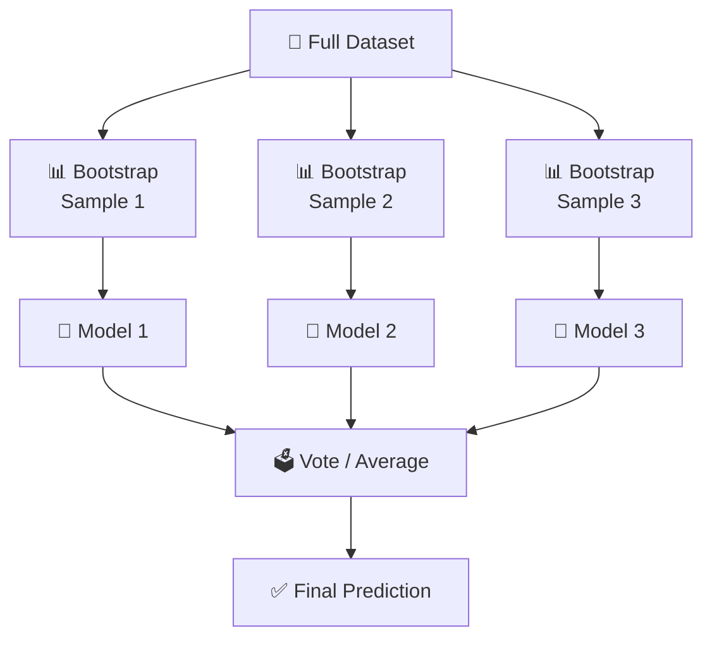
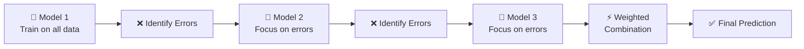
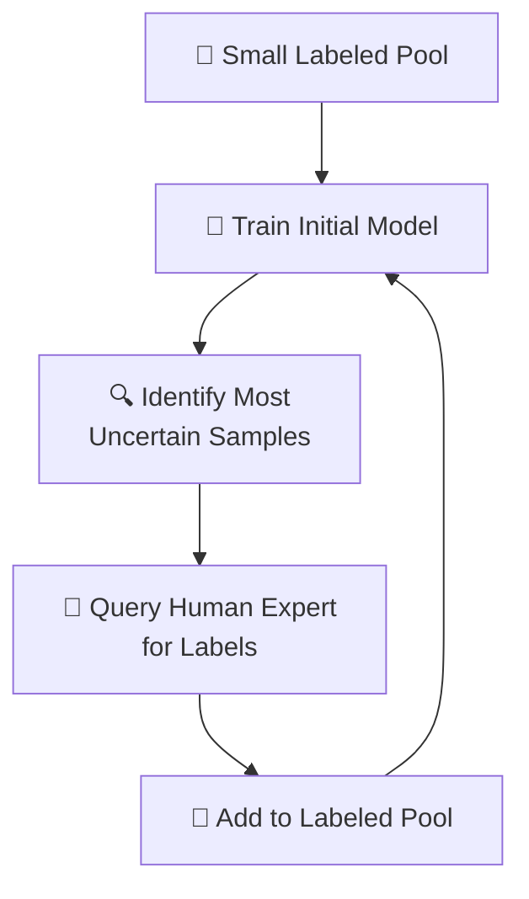
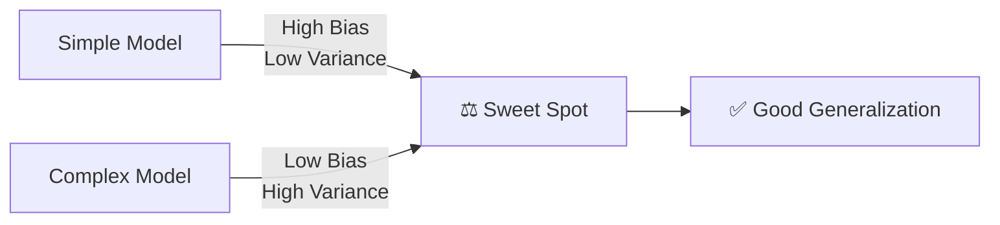

# 🤝 Chapter 4: Advanced Learning Techniques — Team Players

> "One model is good. Many models working together are powerful."

📍 **Navigation:** [🏠 Home](../readme.md) | [← Chapter 3](../Chapter%203%20-%20Neural%20Networks/chap3.md) | **Chapter 4** | [Chapter 5: Reinforcement Learning →](../Chapter%205%20-%20Reinforcement%20Learning/chap5.md)

---

> [!TIP]
> **⚡ Key Takeaways**
> - **Ensemble Learning** combines multiple models to outperform any single model
> - **Bagging** trains models in parallel and reduces **variance** (e.g., Random Forest)
> - **Boosting** trains models sequentially and reduces **bias** (e.g., AdaBoost, XGBoost)
> - **Active Learning** minimizes labeling effort by querying only uncertain samples
> - **KNN** is a lazy learner — it memorizes training data instead of building a model

---

# 📌 1. What are Advanced Learning Techniques?

These are methods used to **improve model performance, accuracy, and efficiency** beyond basic algorithms.

They focus on:
- Combining multiple models (Ensemble Learning)
- Learning efficiently with less labeled data (Active Learning)
- Making decisions based on stored examples (Instance-Based Learning)

$$
\text{Multiple Strategies} \Rightarrow \text{Better Predictions}
$$

---

# 🔀 2. Types of Advanced Learning

| Type | Core Idea | Key Algorithm |
|------|-----------|---------------|
| Ensemble Learning | Combine multiple models | Random Forest, XGBoost |
| Active Learning | Model selects its own training data | Query-by-Committee |
| Instance-Based Learning | Memorize and compare | KNN |

---

# 🤝 3. Ensemble Learning

## 📌 Definition

Combining multiple **weak learners** into a single **strong learner**.

> A weak learner is a model that performs only slightly better than random guessing.

## 🎯 Intuition

Like asking a **committee of experts** instead of a single person — the collective decision is more reliable.

## 🧮 Averaging Ensemble

$$
\hat{y} = \frac{1}{n} \sum_{i=1}^{n} \hat{y}_i
$$


---

# 🔁 4. Types of Ensemble Methods

## 🧩 4.1 Bagging — Bootstrap Aggregating

### 📌 Idea

Train multiple models **independently in parallel** on random subsets of data (with replacement).



### ✅ Advantages
- Reduces **variance**
- Prevents overfitting
- Easy to parallelize

### 🌲 Key Algorithm: Random Forest

Random Forest = Bagging + Random Feature Selection at each split

---

## 🔗 4.2 Boosting

### 📌 Idea

Train models **sequentially** — each new model focuses on the **mistakes of the previous one**.



### 🔥 Popular Algorithms

| Algorithm | Description |
|-----------|-------------|
| **AdaBoost** | Upweights misclassified samples each round |
| **Gradient Boosting** | Fits each new model to the residual errors |
| **XGBoost** | Optimized Gradient Boosting — fast and regularized |

### ✅ Advantages
- High accuracy
- Handles bias well
- Often wins ML competitions

---

# ⚖️ 5. Bagging vs Boosting — Full Comparison

| Feature | Bagging | Boosting |
|---------|---------|----------|
| Training Order | Parallel (independent) | Sequential (dependent) |
| Focus | Reduce **variance** | Reduce **bias** |
| Model Dependency | Independent models | Each model corrects the last |
| Speed | Faster | Slower |
| Overfitting Risk | Lower | Higher (if too many rounds) |
| Example | Random Forest | AdaBoost, XGBoost |
| Best When | High variance (overfitting) | High bias (underfitting) |

> [!NOTE]
> **When to choose what?**
> - Your single model overfits → use **Bagging**
> - Your single model underfits → use **Boosting**


---

# 🤖 6. Active Learning

## 📌 Definition

The model selects the **most informative (uncertain) samples** and asks a human expert to label them.

## 🎯 Goal

Learn effectively with **less labeled data** — critical when labeling is expensive (medical, legal data).

## 🔁 Workflow



## 💡 Example

A spam filter that asks: *"Is this borderline email spam or not?"*


---

# 🧠 7. Instance-Based Learning

## 📌 Definition

Instead of building an explicit model, the algorithm **stores all training data** and makes predictions by comparing new inputs to stored examples.

## 🎯 Core Idea

> "No general rule — just remember and compare at prediction time."

This is called **lazy learning** — the model defers computation until a prediction is needed.


---

# 📍 8. KNN — K-Nearest Neighbors

## 📌 How It Works

1. Store all training examples
2. For a new input, calculate distance to all training points
3. Select the $K$ nearest neighbors
4. For **classification**: majority vote; for **regression**: average

## 🧮 Distance Formula — Euclidean

$$
d = \sqrt{\sum_{i=1}^{n} (x_i - y_i)^2}
$$

## 📊 Choosing K

| K Value | Effect |
|---------|--------|
| Small K (e.g. K=1) | Very sensitive to noise, may overfit |
| Large K | Smoother boundary, may underfit |
| Odd K | Avoids ties in binary classification |

> [!TIP]
> A common starting point is $K = \sqrt{n}$ where $n$ is the number of training samples.

---

# ⚙️ 9. Bias vs Variance Trade-off

## 📌 Definition

| Concept | Meaning | Cause | Fix |
|---------|---------|-------|-----|
| **Bias** | Error from overly simple model | Too few features, linear model on complex data | More complex model, more features |
| **Variance** | Error from overly complex model | Too many features, model memorizes noise | More data, Regularization, Bagging |



---

# 🧪 10. Real-World Applications

| Domain | Use Case | Algorithm |
|--------|----------|-----------|
| Finance | Credit scoring | Gradient Boosting |
| Healthcare | Diagnosis systems | Random Forest |
| E-commerce | Recommendation engines | KNN |
| Cybersecurity | Threat detection | Random Forest / XGBoost |
| Medical Imaging | Labeling assistance | Active Learning |

---

# 🔑 11. Key Terms Glossary

| Term | Definition |
|------|-----------|
| **Ensemble Learning** | Combining multiple models to improve performance |
| **Bagging** | Parallel training on random bootstrap samples |
| **Boosting** | Sequential training, each model corrects previous errors |
| **Random Forest** | Bagging + random feature subsets at each split |
| **AdaBoost** | Boosts by upweighting misclassified samples |
| **XGBoost** | Regularized, optimized Gradient Boosting |
| **Active Learning** | Model queries human for labels on uncertain samples |
| **KNN** | Predicts based on majority vote of K nearest neighbors |
| **Lazy Learning** | No training phase — defers computation to prediction time |
| **Bias** | Error from wrong assumptions in the model |
| **Variance** | Error from sensitivity to training data fluctuations |

---

# 💡 12. Practice Ideas

| Project | Algorithm | Dataset |
|---------|-----------|---------|
| 🌲 Titanic Survival Predictor | Random Forest | Kaggle Titanic |
| 📈 Stock Movement Classifier | XGBoost | Yahoo Finance |
| 🏥 Disease Diagnosis System | AdaBoost | UCI Heart Disease |
| 🎬 Movie Recommendation | KNN | MovieLens |

**Starter code — Random Forest:**

```python
from sklearn.ensemble import RandomForestClassifier

model = RandomForestClassifier(
    n_estimators=100,   # Number of trees
    max_depth=5,        # Max depth per tree
    random_state=42
)
model.fit(X_train, y_train)
print(model.score(X_test, y_test))

# Feature importance
import pandas as pd
importance = pd.Series(model.feature_importances_, index=feature_names)
importance.sort_values().plot(kind='barh')
```

---

# 📚 13. Further Reading

- 📖 [Scikit-Learn: Ensemble Methods](https://scikit-learn.org/stable/modules/ensemble.html)
- 🎥 [StatQuest: Random Forests](https://www.youtube.com/watch?v=J4Wdy0Wc_xQ)
- 🎥 [StatQuest: AdaBoost](https://www.youtube.com/watch?v=LsK-xG1cLYA)
- 📖 [XGBoost Documentation](https://xgboost.readthedocs.io/)
- 📖 [Active Learning Literature Survey](https://burrsettles.com/pub/settles.activelearning.pdf)

---

# 🚀 Final Thought

Advanced techniques turn basic models into **powerful, production-ready systems**.

The key insight: no single model is always the best — knowing **when and how to combine** models is what separates good from great ML engineers.

---

📍 **Navigation:** [🏠 Home](../readme.md) | [← Chapter 3](../Chapter%203%20-%20Neural%20Networks/chap3.md) | **Chapter 4** | [Chapter 5: Reinforcement Learning →](../Chapter%205%20-%20Reinforcement%20Learning/chap5.md)
