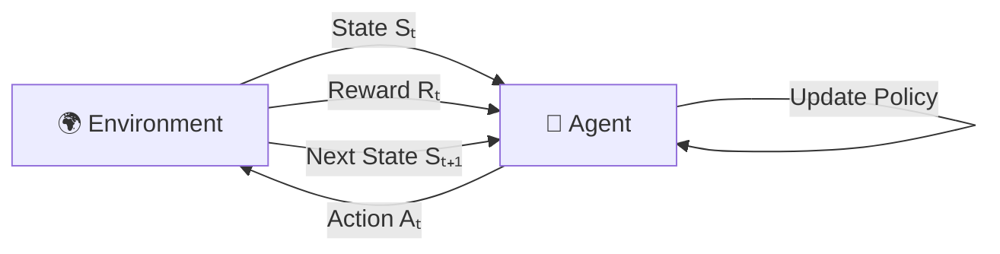
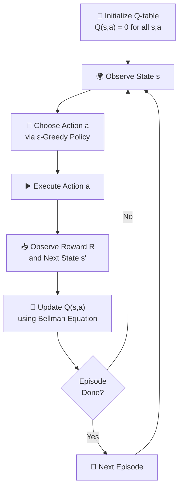

# 🎮 Chapter 5: Reinforcement Learning — Trial-and-Error Gamers

> "Learning by doing — and improving with rewards."

📍 **Navigation:** [🏠 Home](../readme.md) | [← Chapter 4](../Chapter%204%20-%20Advanced%20Learning/chap4.md) | **Chapter 5**

---

> [!TIP]
> **⚡ Key Takeaways**
> - RL learns through **interaction** — no labeled data needed
> - An **agent** takes actions in an **environment** and receives **rewards**
> - The goal is to learn a **policy** that maximizes total cumulative reward
> - **Q-Learning** is the foundational RL algorithm — it learns a value for each (state, action) pair

---

# 📌 1. What is Reinforcement Learning?

Reinforcement Learning (RL) is a type of Machine Learning where an **agent learns by interacting with an environment**.

- No labeled data
- No predefined answers
- Learning happens via **rewards and penalties**

$$
\text{Agent} + \text{Environment} \rightarrow \text{Experience} \rightarrow \text{Learning}
$$


---

# 🎯 2. Core Components

| Component | Description | Analogy |
|-----------|-------------|---------|
| **Agent** | The learner / decision-maker | The player |
| **Environment** | The world the agent acts in | The game |
| **State (S)** | Current situation of the agent | Position on the board |
| **Action (A)** | What the agent does | Move left, jump, fire |
| **Reward (R)** | Feedback signal from environment | +10 for goal, -1 for penalty |
| **Policy (π)** | Strategy mapping states to actions | The agent's rulebook |

---

# 🔁 3. RL Interaction Loop



$$
S_t \rightarrow A_t \rightarrow R_t \rightarrow S_{t+1}
$$

### 📌 Step-by-Step

1. Agent observes the current state $S_t$
2. Agent selects an action $A_t$ based on its policy
3. Environment returns reward $R_t$ and transitions to new state $S_{t+1}$
4. Agent updates its knowledge
5. Repeat until the episode ends


---

# 🧠 4. Goal of Reinforcement Learning

Maximize the **total discounted reward** over time:

$$
\text{Maximize} \sum_{t=0}^{\infty} \gamma^t R_t
$$

Where:
- $\gamma \in$ `[0, 1]` = **discount factor** (how much future rewards are valued)
- $\gamma = 0$ → only care about immediate reward
- $\gamma = 1$ → care equally about all future rewards

---

# 🎲 5. Exploration vs Exploitation

## ⚖️ The Fundamental Trade-off

| Concept | Meaning | Risk |
|---------|---------|------|
| **Exploration** | Try new, unknown actions | May waste time on bad actions |
| **Exploitation** | Use the best known action | May miss better options |

## 🎯 Finding the Balance

| Strategy | Approach |
|----------|---------|
| Too much exploration | Slow learning — never settles on good strategy |
| Too much exploitation | Gets stuck in local optimum — misses better paths |
| ε-Greedy | Explore with probability $\varepsilon$, exploit otherwise |

> [!TIP]
> Start with high ε (explore a lot early), then decay it over time as the agent gets smarter. This is called **ε-decay**.


---

# 🧭 6. Policy

## 📌 Definition

A **policy** $\pi$ defines what action the agent takes in each state.

$$
\pi(a \mid s)
$$

This is the probability of taking action $a$ in state $s$.

## 📊 Types of Policies

| Type | Description | Example |
|------|-------------|---------|
| **Deterministic** | One fixed action per state | Always go left in state X |
| **Stochastic** | Actions chosen with probabilities | 70% left, 30% right in state X |
| **Optimal (π*)** | Policy that maximizes total reward | The goal of RL |

---

# 📈 7. Value Functions

## 📌 State Value Function V(s)

Expected total reward starting from state $s$:

$$
V(s) = \mathbb{E}\left\lbrack R_t \mid S = s\right\rbrack
$$

A high $V(s)$ means state $s$ is favorable.

---

## 📌 Action Value Function Q(s, a)

Expected total reward taking action $a$ in state $s$:

$$
Q(s,a) = \mathbb{E}\left\lbrack R_t \mid S = s, A = a\right\rbrack
$$

- Also called the **Q-value** or **action-value**
- Q-Learning learns these values directly

## 📊 V(s) vs Q(s, a)

| | V(s) | Q(s, a) |
|-|------|---------|
| Input | State only | State + Action |
| Answers | "How good is this state?" | "How good is this action in this state?" |
| Used in | Policy iteration | Q-Learning, DQN |

---

# 🔄 8. Q-Learning

## 📌 Idea

Learn the **optimal Q-values** for every (state, action) pair — then derive the optimal policy.

$$
\pi^*(s) = \arg\max_a Q(s, a)
$$

## 🧮 Q-Learning Update Rule

$$
Q(s,a) \leftarrow Q(s,a) + \alpha \left\lbrack R + \gamma \max_{a'} Q(s',a') - Q(s,a)\right\rbrack
$$

Where:
- $\alpha$ = learning rate (how fast to update)
- $\gamma$ = discount factor
- $R + \gamma \max_{a'} Q(s',a')$ = **TD Target** (new estimate)
- $R + \gamma \max_{a'} Q(s',a') - Q(s,a)$ = **TD Error** (correction)

## 🔁 Q-Learning Algorithm Flow



---

# 🎮 9. Markov Property

## 📌 Definition

The future state depends **only on the current state** — not on the history of past states.

$$
P(S_{t+1} \mid S_t)
$$

This simplifying assumption is called the **Markov Property** and is the foundation of Markov Decision Processes (MDPs).

> [!NOTE]
> Most RL problems are formulated as **Markov Decision Processes (MDPs)** — a mathematical framework with states, actions, transition probabilities, and rewards.


---

# ⚙️ 10. Key Concepts Reference

| Concept | Description |
|---------|-------------|
| **Episode** | One complete run of the environment (start to terminal state) |
| **Reward Signal** | Guides learning — positive for good actions, negative for bad |
| **Discount Factor γ** | Trades off immediate vs. future rewards |
| **Q-Table** | Lookup table of Q-values for each (state, action) pair |
| **Bellman Equation** | Recursive formula for computing optimal Q-values |
| **TD Error** | Difference between predicted and new Q-value estimate |

---

# 🧪 11. Types of RL Algorithms

| Category | Description | Algorithms |
|----------|-------------|-----------|
| **Model-Free** | No knowledge of environment dynamics | Q-Learning, SARSA, DQN |
| **Model-Based** | Builds/uses a model of the environment | Dyna-Q, World Models |
| **Policy-Based** | Directly optimizes the policy | REINFORCE, PPO |
| **Value-Based** | Learns value function, derives policy | Q-Learning, DQN |
| **Actor-Critic** | Combines policy and value learning | A3C, SAC |

---

# 🧪 12. Real-World Applications

| Domain | Use Case | Notable Example |
|--------|----------|----------------|
| Gaming | Game-playing agents | AlphaGo, OpenAI Five |
| Robotics | Navigation & manipulation | Boston Dynamics |
| Finance | Algorithmic trading | Portfolio optimization |
| Autonomous Vehicles | Self-driving decisions | Tesla, Waymo |
| Healthcare | Drug dosage optimization | Sepsis treatment |
| NLP | Fine-tuning LLMs | ChatGPT (RLHF) |

---

# 💻 Code Example

### 🔹 Simple RL Agent Structure
A basic template for a Q-learning agent with exploration and exploitation logic.

```python
import numpy as np

class SimpleAgent:
    def __init__(self, n_states, n_actions):
        self.q_table = np.zeros((n_states, n_actions))
        self.alpha = 0.1    # Learning Rate
        self.gamma = 0.9    # Discount Factor
        self.epsilon = 0.1  # Exploration Rate

    def choose_action(self, state):
        # ε-greedy policy
        if np.random.rand() < self.epsilon:
            return np.random.choice(len(self.q_table[state])) # Explore
        else:
            return np.argmax(self.q_table[state])             # Exploit

    def update(self, state, action, reward, next_state):
        # Bellman Equation Update
        best_next = np.max(self.q_table[next_state])
        self.q_table[state, action] += self.alpha * (
            reward + self.gamma * best_next - self.q_table[state, action]
        )
```

### 🔹 Q-Learning Training Loop
The complete process of an agent interacting with an environment to learn optimal values.

```python
import gymnasium as gym

def q_learning(env, episodes=2000):
    # 1. Initialize Q-table
    Q = np.zeros((env.observation_space.n, env.action_space.n))
    
    for ep in range(episodes):
        state, _ = env.reset()
        done = False
        
        while not done:
            # 2. Choose action (ε-greedy)
            action = np.argmax(Q[state]) if np.random.rand() > 0.1 else env.action_space.sample()
            
            # 3. Take action
            next_state, reward, terminated, truncated, _ = env.step(action)
            done = terminated or truncated
            
            # 4. Update Q-value
            best_next = np.max(Q[next_state])
            Q[state, action] += 0.1 * (reward + 0.9 * best_next - Q[state, action])
            
            state = next_state
    return Q
```

---

# 🔑 13. Key Terms Glossary

| Term | Definition |
|------|-----------|
| **Agent** | The learner that interacts with the environment |
| **Environment** | The world the agent operates in |
| **State (S)** | A snapshot of the current situation |
| **Action (A)** | A choice made by the agent |
| **Reward (R)** | Scalar feedback signal from the environment |
| **Policy (π)** | Mapping from states to actions |
| **V(s)** | Expected future reward from state s |
| **Q(s,a)** | Expected future reward from taking action a in state s |
| **Episode** | One complete sequence from start to terminal state |
| **ε-Greedy** | Exploration strategy: explore with probability ε |
| **MDP** | Markov Decision Process — formal framework for RL |
| **Bellman Equation** | Recursive relationship for optimal Q-values |
| **RLHF** | Reinforcement Learning from Human Feedback |

---

# 💡 14. Practice Ideas

| Project | Description | Tools |
|---------|-------------|-------|
| 🧩 Maze Solver | Q-Learning agent solves a grid maze | Python + NumPy |
| 🏓 CartPole Balancer | Balance a pole using Deep Q-Networks | OpenAI Gym |
| 🎮 Atari Game Agent | Train an agent to play classic games | Stable-Baselines3 |
| 🧠 Custom Grid World | Build and solve your own environment | Python from scratch |

**Starter code — Q-Learning on CartPole:**

```python
import gym
import numpy as np

env = gym.make('CartPole-v1')
Q = np.zeros((env.observation_space.n, env.action_space.n))

alpha, gamma, epsilon = 0.1, 0.99, 0.1

for episode in range(1000):
    state = env.reset()
    done = False
    while not done:
        # ε-greedy action selection
        if np.random.rand() < epsilon:
            action = env.action_space.sample()   # Explore
        else:
            action = np.argmax(Q[state])          # Exploit

        next_state, reward, done, _ = env.step(action)

        # Q-Learning update
        Q[state, action] += alpha * (
            reward + gamma * np.max(Q[next_state]) - Q[state, action]
        )
        state = next_state
```

---

# 📚 15. Further Reading

- 📖 [Spinning Up in Deep RL (OpenAI)](https://spinningup.openai.com/)
- 🎥 [David Silver: RL Lectures (DeepMind)](https://www.youtube.com/playlist?list=PLqYmG7hTraZDM-OYHWgPebj2MfCFzFObQ)
- 📖 [Sutton & Barto: Reinforcement Learning (free book)](http://incompleteideas.net/book/the-book-2nd.html)
- 📖 [Stable-Baselines3 Docs](https://stable-baselines3.readthedocs.io/)
- 📖 [OpenAI Gym](https://gymnasium.farama.org/)

---

# 🚀 Final Thought

Reinforcement Learning powers **intelligent decision-making systems** — from game-playing AI to robots to ChatGPT's alignment.

Master this, and you unlock true AI behavior: agents that learn, adapt, and improve on their own.

---

📍 **Navigation:** [🏠 Home](../readme.md) | [← Chapter 4](../Chapter%204%20-%20Advanced%20Learning/chap4.md) | **Chapter 5**
