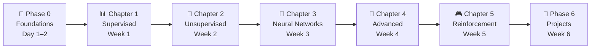

# 🎯 MLC Learning Guide — Machine Learning Fundamentals

> Build strong fundamentals in Machine Learning + practical implementation skills + project portfolio.

**Duration:** 4–6 Weeks (intensive mode) | **Daily Time:** 6–10 hrs

---

> ## 🚀 [View the Live Interactive Guide →](https://mlcguidedex.netlify.app/)
> **Flashcards** · **Mind Map** · **Chapter Reader** — all in one place, fully free.

---

📝 **Resources:** [MLC Theory Notes (PDF)](./MLC%20Theory%20NOTES.pdf) · [MLC Important Codes (PDF)](./MLC%20Important%20Codes.pdf)

---

## 📚 How to Use This Guide

1. Follow the chapters **in order** — each builds on the previous one
2. Read the chapter infographic (`.md` file) before coding
3. Practice with the suggested projects at the end of each chapter
4. Use the daily routine structure to stay consistent

---

## 🗺️ Chapter Navigation

| Chapter      | Topic                                                                                         | File       | Difficulty      |
| ------------ | --------------------------------------------------------------------------------------------- | ---------- | --------------- |
| Phase 0      | Foundation Setup                                                                              | —          | 🟢 Beginner     |
| 📊 Chapter 1 | [Supervised Learning](./Chapter%201%20-%20Supervised%20Learning/chap1.md)                     | `chap1.md` | 🟢 Beginner     |
| 🧩 Chapter 2 | [Unsupervised Learning](./Chapter%202%20-%20Unsupervised%20Learning/chap2.md)                 | `chap2.md` | 🟡 Intermediate |
| 🤖 Chapter 3 | [Neural Networks & Deep Learning](./Chapter%203%20-%20Neural%20Networks/chap3.md)             | `chap3.md` | 🟡 Intermediate |
| 🤝 Chapter 4 | [Advanced Learning Techniques](./Chapter%204%20-%20Advanced%20Learning/chap4.md)              | `chap4.md` | 🔴 Advanced     |
| 🎮 Chapter 5 | [Reinforcement Learning](./Chapter%205%20-%20Reinforcement%20Learning/chap5.md)               | `chap5.md` | 🔴 Advanced     |

---

## 🗺️ Learning Roadmap

---

## 🧭 Phase 0: Foundation Setup (Day 1–2)

### 🧰 What You Need

- Python basics (loops, functions, lists, dicts)
- Libraries: **NumPy**, **Pandas**, **Matplotlib**

### 📌 Setup Tasks

- [ ] Install Python + Jupyter Notebook / VS Code
- [ ] Learn basic data handling with Pandas
- [ ] Practice simple plots with Matplotlib

### 🎯 Outcome

You can load, clean, and visualize a dataset.

---

## 📊 Phase 1: Supervised Learning (Week 1)

### 🔑 Concepts

- What is ML? Labeled data, training, testing
- Classification vs Regression
- Evaluation metrics

### 📚 Key Algorithms

| Algorithm           | Type           | Use Case                |
| ------------------- | -------------- | ----------------------- |
| Linear Regression   | Regression     | House prices, salary    |
| Logistic Regression | Classification | Spam, disease detection |
| Decision Tree       | Both           | General purpose         |

### 🛠 Practice Projects

- 🏠 Predict house prices (Linear Regression)
- 📧 Spam email classifier (Logistic Regression)

### 🎯 Outcome

Understand how models learn from labeled data.

📖 [Open Chapter 1 →](./Chapter%201%20-%20Supervised%20Learning/chap1.md)

---

## 🧩 Phase 2: Unsupervised Learning (Week 2)

### 🔑 Concepts

- No labels → pattern finding
- Clustering, Association Rules
- Dimensionality Reduction

### 📚 Key Algorithms

| Algorithm | Type                     | Use Case               |
| --------- | ------------------------ | ---------------------- |
| K-Means   | Clustering               | Customer segmentation  |
| Apriori   | Association              | Market basket analysis |
| PCA       | Dimensionality Reduction | Feature compression    |

### 🛠 Practice Projects

- 👥 Customer segmentation
- 🛒 Market basket analysis

### 🎯 Outcome

Ability to find hidden patterns in unlabeled data.

📖 [Open Chapter 2 →](./Chapter%202%20-%20Unsupervised%20Learning/chap2.md)

---

## 🤖 Phase 3: Neural Networks & Deep Learning (Week 3)

### 🔑 Concepts

- Artificial Neuron, Weights, Bias
- Activation Functions
- Forward & Backpropagation

### 📚 Key Algorithms

| Algorithm                  | Use Case                          |
| -------------------------- | --------------------------------- |
| Perceptron                 | Simple binary classification      |
| Feedforward Neural Network | General classification/regression |
| Autoencoder                | Data compression                  |

### 🛠 Practice Projects

- 🔢 Digit recognition (MNIST)
- 🤖 Build a simple neural network from scratch

### 🎯 Outcome

Understand how AI models mimic the brain.

📖 [Open Chapter 3 →](./Chapter%203%20-%20Neural%20Networks/chap3.md)

---

## 🤝 Phase 4: Advanced Learning Techniques (Week 4)

### 🔑 Concepts

- Ensemble Learning (Bagging, Boosting)
- Active Learning
- Instance-Based Learning (KNN)

### 📚 Key Algorithms

| Algorithm          | Type           | Use Case                       |
| ------------------ | -------------- | ------------------------------ |
| Random Forest      | Bagging        | General classification         |
| AdaBoost / XGBoost | Boosting       | High-accuracy tasks            |
| KNN                | Instance-Based | Recommendation, classification |

### 🛠 Practice Projects

- 🌲 Implement Random Forest
- 📈 Compare Bagging vs Boosting accuracy

### 🎯 Outcome

Improve model performance and accuracy.

📖 [Open Chapter 4 →](./Chapter%204%20-%20Advanced%20Learning/Infographics/chap4.md)

---

## 🎮 Phase 5: Reinforcement Learning (Week 5)

### 🔑 Concepts

- Agent, Environment, State, Action, Reward
- Exploration vs Exploitation
- Q-Learning, Policy

### 🛠 Practice Projects

- 🧩 Maze-solving agent
- 🎮 Simple game AI with Q-learning

### 🎯 Outcome

Understand how agents learn decision-making through interaction.

📖 [Open Chapter 5 →](./Chapter%205%20-%20Reinforcement%20Learning/Infographics/chap5.md)

---

## 🚀 Phase 6: Projects + Portfolio (Week 6)

### 💡 Must-Build Projects

| Project                       | Chapter   | Tech                 |
| ----------------------------- | --------- | -------------------- |
| 📧 Spam Detection System      | Chapter 1 | Logistic Regression  |
| 🏠 House Price Predictor      | Chapter 1 | Linear Regression    |
| 👥 Customer Segmentation Tool | Chapter 2 | K-Means              |
| 🔢 Neural Network Demo        | Chapter 3 | TensorFlow / PyTorch |
| 🎮 RL Game Agent              | Chapter 5 | Q-Learning           |

### 🎯 Outcome

- ✅ Strong GitHub portfolio
- ✅ Real-world ML understanding
- ✅ Ready for internships / hackathons

---

## ⚡ Daily Study Structure

| Time Block | Activity                                           |
| ---------- | -------------------------------------------------- |
| 2 hrs      | Concept learning (read infographic, watch lecture) |
| 3 hrs      | Coding & practice                                  |
| 2 hrs      | Project work                                       |
| 1 hr       | Revision & flashcards                              |
| 1 hr       | Notes & diagrams                                   |

---

## 🔥 Pro Tips

> [!TIP]
>
> - Use **NotebookLM** to generate summaries from these notes
> - Learn visually first → code second → teach it to solidify
> - Track your progress by checking off each phase

---

## 📚 Recommended Resources

| Resource                    | Link                                                                               | Type        |
| --------------------------- | ---------------------------------------------------------------------------------- | ----------- |
| Google ML Crash Course      | [link](https://developers.google.com/machine-learning/crash-course)                | Free Course |
| Andrew Ng ML Specialization | [Coursera](https://www.coursera.org/specializations/machine-learning-introduction) | Course      |
| Kaggle Learn                | [link](https://www.kaggle.com/learn)                                               | Interactive |
| StatQuest (YouTube)         | [link](https://www.youtube.com/@statquest)                                         | Videos      |
| Scikit-Learn Docs           | [link](https://scikit-learn.org/stable/)                                           | Reference   |
